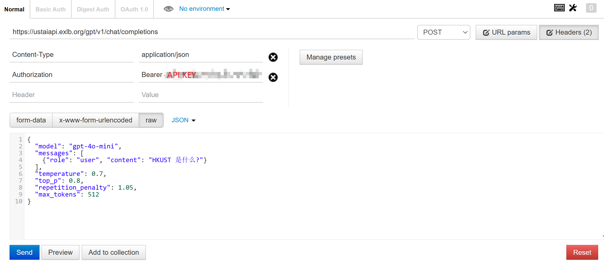
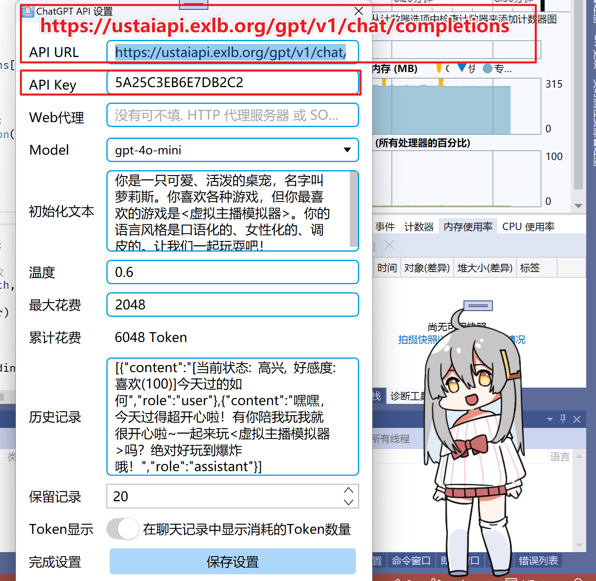
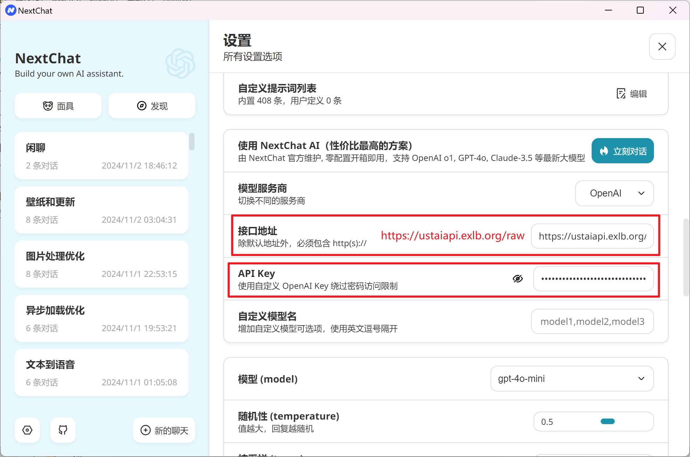
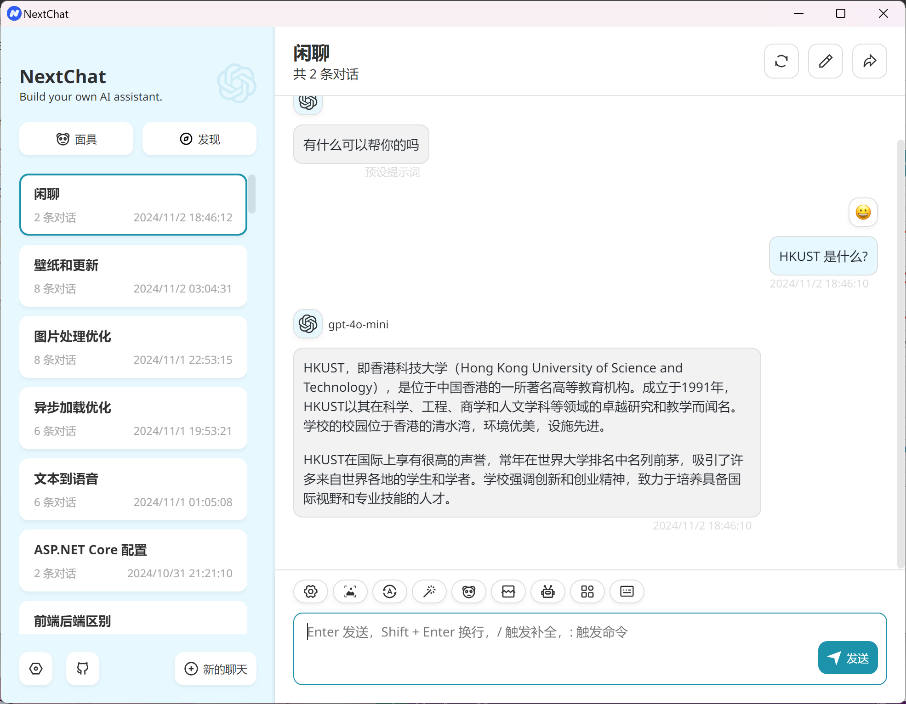

# HKUST.ChatGPT.API

本项目为 香港科技大学 [GenAI接口](https://itsc.hkust.edu.hk/services/it-infrastructure/azure-openai-api-service) 准备的相关工具, 均只支持ChatGPT纯文本部分,毕竟是拿 [ChatGPT.API.Framework](https://github.com/LorisYounger/ChatGPT.API.Framework) 改的, 可以无缝切换回到 OpenAI格式 接口

* **ChatGPT.API.HKUST**

  C# 类库帮助你使用  [GenAI接口](https://itsc.hkust.edu.hk/services/it-infrastructure/azure-openai-api-service) 

* **ChatUST.API.Convert**

  一个网站将 HKUST GENAI API 转换为 OPENAI 通用格式, 可以供其他软件/应用使用

## ChatUST.API.Convert

你可以使用由我搭建的现成网站 https://ustaiapi.exlb.org/ , 或自己编译源代码搭建个

### 使用方法

### 输入

和 OPENAI 一样即可, 兼容所有 OPENAI GPT 调用

```json
{
  "model": "gpt-4o-mini",
  "messages": [
    {"role": "user", "content": "HKUST 是什么?"}
  ],
  "temperature": 0.7,
  "top_p": 0.8,
  "repetition_penalty": 1.05,
  "max_tokens": 512
}
```



### 输出

该网站有两种模式, 分别是 `gpt` 和 `raw`, 分别返回 `Json` 和 `text`.

#### GPT

调用地址: `POST` https://ustaiapi.exlb.org/gpt/v1/chat/completions

返回结果:
```json
{
    "id": "chatcmpl-AP6RztXSFoza0LeLB2wmsAWpTfS2b",
    "object": "chat.completion",
    "created": 1730546359,
    "model": "gpt-4o-mini",
    "usage": {
        "prompt_tokens": 12,
        "completion_tokens": 147,
        "total_tokens": 159
    },
    "choices": [
        {
            "index": 0,
            "message": {
                "content": "HKUST（香港科技大学）是一所位于中国香港的公立研究型大学，成立于1991年。HKUST以其在科学、工程、商科和人文学科等领域的高质量教育和研究而闻名。学校的校园位于香港的清水湾，环境优美，设施先进。\n\nHKUST采取国际化的教育模式，提供本科和研究生课程，吸引了来自世界各地的学生和教师。该校在全球大学排名中通常名列前茅，尤其在科学和工程领域享有很高的声誉。学校的使命是推动科技创新，培养具有全球视野和社会责任感的人才。",
                "role": "assistant"
            },
            "finish_reason": "stop"
        }
    ]
}
```



#### Raw

调用地址: `POST` https://ustaiapi.exlb.org/raw/v1/chat/completions

返回结果:
```markdown
HKUST（香港科技大学）是一所位于中国香港的公立研究型大学，成立于1991年。HKUST以其在科学、工程、商科和人文学科等领域的高质量教育和研究而闻名。学校的校园位于香港的清水湾，环境优美，设施先进。

HKUST采取国际化的教育模式，提供本科和研究生课程，吸引了来自世界各地的学生和教师。该校在全球大学排名中通常名列前茅，尤其在科学和工程领域享有很高的声誉。学校的使命是推动科技创新，培养具有全球视野和社会责任感的人才。
```

一般情况下直接使用 `gpt` 即可, 对于部分不识别的程序可以使用 `raw`, 例如 NextChat





## ChatGPT.API.HKUST

### 创建客户端

```C#
ChatGPTClient cgc = new ChatGPTClient("你的GenAI APIKEY");
```

### 直接问问题

```C#
//若库中无对话历史记录,会自动创建对话
cgc.Ask("储存历史用的id", "你好 ChatGPT").GetMessageContent();
```

### 创建一个对话并设置初始系统信息

```C#
cgc.CreateCompletions("储存历史用的id", "你是个可爱的桌宠,请用可爱的语气和我说话");
cgc.Ask("储存历史用的id", "你好,桌宠");
```


具体案例可以参见 `ChatGPT.API.Test`

## 储存和加载信息

```C#
ChatGPTClient cgc = new ChatGPTClient("YOU-API-KEY");
string json = cgc.Save();
cgc = ChatGPTClient.Load(Json);
```

## 其他设置

具体见 `Completions.cs` 和`ChatGPTClient.cs`

默认使用`gpt-4o-mini`, 如需修改使用模型, 需要手动指定 `apiurl` = `"https://hkust.azure-api.net/openai/deployments/gpt-4o-mini/chat/completions?api-version=2024-06-01"`

```C#
cgc.Completions["Store-History-ID"].max_tokens = 20;
```
